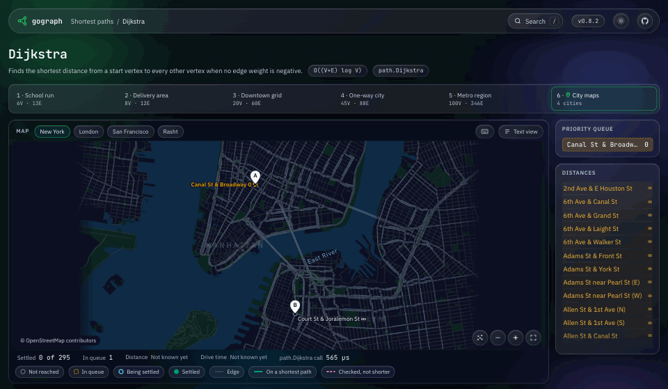
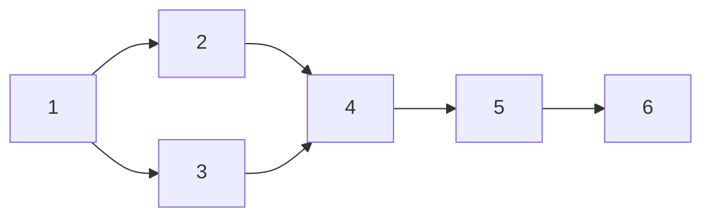
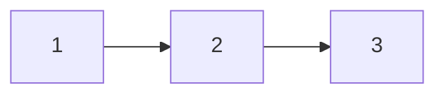
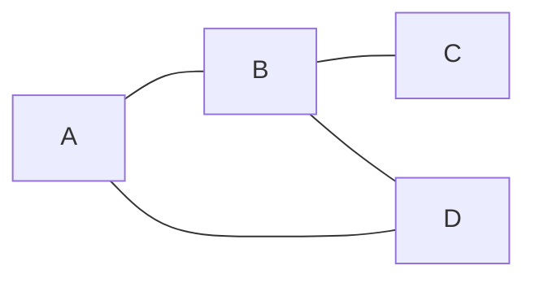
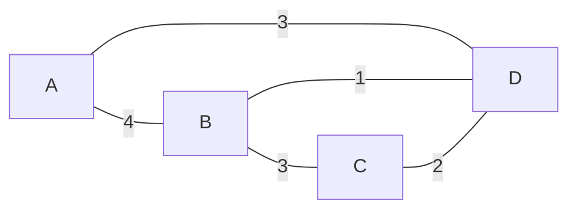
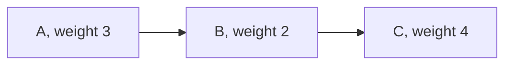
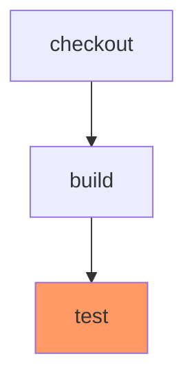

<p align="center">
  
</p>

<p align="center">
  <b>Dependency graphs and graph algorithms for Go, with no dependencies outside the standard library.</b>
</p>

<p align="center">
  <a href="https://github.com/hmdsefi/gograph/actions/workflows/build.yml"></a>
  <a href="https://github.com/hmdsefi/gograph/actions/workflows/build.yml?query=branch%3Amaster"></a>
  <a href="https://pkg.go.dev/github.com/hmdsefi/gograph"></a>
  <a href="https://github.com/hmdsefi/gograph/releases"></a>
  <a href="go.mod"></a>
  <a href="LICENSE"></a>
  <a href="https://github.com/avelino/awesome-go#science-and-data-analysis"></a>
  <a href="https://coderabbit.ai"></a>
  <a href="https://github.com/sponsors/hmdsefi"></a>
  <a href="https://github.com/hmdsefi/gograph"></a>
</p>

<p align="center">
  <a href="https://pkg.go.dev/github.com/hmdsefi/gograph"><b>Documentation</b></a> ·
  <a href="https://gograph.dev"><b>Interactive demos</b></a> ·
  <a href="examples"><b>Examples</b></a> ·
  <a href="CHANGELOG.md"><b>Changelog</b></a> ·
  <a href="https://github.com/hmdsefi/gograph/issues/136"><b>Roadmap</b></a>
</p>

<p align="center">
  <a href="https://gograph.dev/algorithms/dijkstra/new-york">
    
  </a>
  <br>
  <sub><code>path.Dijkstra</code> finding the quickest drive from Canal St in Manhattan to Court St in Brooklyn on <a href="https://gograph.dev">gograph.dev</a>, where every algorithm runs step by step on example graphs.</sub>
</p>

gograph is a generic graph library for Go (Golang) with first-class support for dependency
graphs. Acyclic graphs refuse edges that would create a cycle, and `TopologySort`
gives you an order to run things in. It also covers traversal, shortest paths,
strongly connected components and graph partitioning.

- **Generic:** vertex labels can be any comparable type, such as strings, integers or your own structs.
- **Graph data structures:** directed, undirected, acyclic (DAG) and weighted graphs, with weights on vertices and edges.
- **Dependency graphs:** `Acyclic()` graphs reject cycles, `TopologySort` returns a valid order, and the `dag` package finds what depends on what and what can run in parallel.
- **Traversal:** BFS (breadth-first search), DFS (depth-first search), topological sort, closest-first and random-walk iterators.
- **Shortest paths:** Dijkstra, Bellman-Ford, Floyd-Warshall, multi-source Dijkstra, k-center and transitive reduction.
- **Connectivity:** strongly connected components with Tarjan, Kosaraju and Gabow, and condensation into a DAG.
- **Partitioning:** maximal cliques (Bron-Kerbosch), Girvan-Newman communities and randomized k-cut.
- **Diagrams:** `encoding/mermaid` writes a graph as a Mermaid flowchart that GitHub renders in Markdown, and `encoding/dot` writes it in the Graphviz DOT language for larger graphs.
- **Deterministic:** a graph built the same way gives the same topological order, components and cliques on every run.

Imported by [20+ public Go modules](https://pkg.go.dev/github.com/hmdsefi/gograph?tab=importedby),
including the Cilium project's [ariane](https://github.com/cilium/ariane),
BoostSecurity's [smokedmeat](https://github.com/boostsecurityio/smokedmeat) and
[simplecontainer](https://github.com/simplecontainer/smr).

<h3 align="center">⭐ If gograph is useful to you, a star on GitHub helps other Go developers find it.</h3>

## Table of contents

* [Installation](#installation)
* [Quick start](#quick-start)
* [Use cases](#use-cases)
* [Graphs](#graphs)
    * [Directed](#directed)
    * [Acyclic](#acyclic)
    * [Undirected](#undirected)
    * [Weighted](#weighted)
* [Traversal](#traversal)
* [Algorithms](#algorithms)
* [Diagrams](#diagrams)
* [Determinism](#determinism)
* [Performance](#performance)
* [Examples](#examples)
* [Stability](#stability)
* [Roadmap](#roadmap)
* [Contributing](#contributing)
* [Sponsoring](#sponsoring)
* [License](#license)

## Installation

```shell
go get github.com/hmdsefi/gograph
```

gograph requires Go 1.26 or later and uses only the standard library.

## Quick start

```go
package main

import (
	"errors"
	"fmt"

	"github.com/hmdsefi/gograph"
)

func main() {
	// An edge A -> B means A has to happen before B.
	g := gograph.New[string](gograph.Acyclic())

	checkout := g.AddVertexByLabel("checkout")
	build := g.AddVertexByLabel("build")
	test := g.AddVertexByLabel("test")
	release := g.AddVertexByLabel("release")

	_, _ = g.AddEdge(checkout, build)
	_, _ = g.AddEdge(build, test)
	_, _ = g.AddEdge(test, release)

	// Acyclic graphs reject any edge that would create a cycle.
	_, err := g.AddEdge(release, checkout)
	fmt.Println(errors.Is(err, gograph.ErrDAGCycle)) // true

	order, _ := gograph.TopologySort(g)
	for _, v := range order {
		fmt.Println(v.Label()) // checkout, build, test, release
	}
}
```

## Use cases

- **Build and CI pipelines:** order the steps with `TopologySort`, run independent
  steps together with `dag.Levels` or `dag.Tracker`, and find the chain of steps that
  sets the total time with `dag.CriticalPath`.
- **Task schedulers and workflow engines:** `dag.Tracker` hands out tasks as their
  dependencies finish.
- **Incremental builds and spreadsheets:** `dag.Affected` lists everything a change
  reaches, so you recompute only that.
- **Module and package dependencies:** find requirement cycles with
  `connectivity.Tarjan` and collapse them with `connectivity.Condense`. The
  [gomodgraph](examples/gomodgraph) example does this for `go mod graph` output.
- **Routing and placement:** shortest routes with `path.Dijkstra`, the nearest depot
  for every address with `path.DijkstraMultiSource`, and where to put k facilities
  with `path.KCenter`.
- **Networks and communities:** loops in service calls with strongly connected
  components, and groups in a social graph with `partition.MaximalCliques` and
  `partition.GirvanNewman`.

## Graphs

`gograph.New[T]` creates a graph. `T` is the vertex label type and must be
comparable, so slices, maps and functions can't be labels. Options choose the kind
of graph:

- `gograph.Directed()` creates a directed graph. Without it, graphs are undirected.
- `gograph.Acyclic()` creates a directed graph that rejects edges that would create a cycle.
- `gograph.Weighted()` marks the graph as weighted. `BellmanFord` and `FloydWarshall` require it.

Every graph implements the `Graph[T]` interface. See the
[package documentation](https://pkg.go.dev/github.com/hmdsefi/gograph#Graph) for the full list
of methods.

`AddEdge` creates missing vertices, so `gograph.NewVertex` is enough for quick
examples. To keep a reference to a vertex, use `AddVertexByLabel`, which adds the
vertex and returns it.

The diagrams in this section are the output of [`encoding/mermaid`](#diagrams) for
each example graph.

### Directed



```go
g := gograph.New[int](gograph.Directed())

_, _ = g.AddEdge(gograph.NewVertex(1), gograph.NewVertex(2))
_, _ = g.AddEdge(gograph.NewVertex(1), gograph.NewVertex(3))
_, _ = g.AddEdge(gograph.NewVertex(2), gograph.NewVertex(4))
_, _ = g.AddEdge(gograph.NewVertex(3), gograph.NewVertex(4))
_, _ = g.AddEdge(gograph.NewVertex(4), gograph.NewVertex(5))
_, _ = g.AddEdge(gograph.NewVertex(5), gograph.NewVertex(6))
```

### Acyclic



```go
g := gograph.New[int](gograph.Acyclic())

_, _ = g.AddEdge(gograph.NewVertex(1), gograph.NewVertex(2))
_, _ = g.AddEdge(gograph.NewVertex(2), gograph.NewVertex(3))

_, err := g.AddEdge(gograph.NewVertex(3), gograph.NewVertex(1))
fmt.Println(err) // edges would create cycle
```

### Undirected



```go
// Graphs are undirected by default.
g := gograph.New[string]()

a := g.AddVertexByLabel("A")
b := g.AddVertexByLabel("B")
c := g.AddVertexByLabel("C")
d := g.AddVertexByLabel("D")

_, _ = g.AddEdge(a, b)
_, _ = g.AddEdge(a, d)
_, _ = g.AddEdge(b, c)
_, _ = g.AddEdge(b, d)

// Every undirected edge can be followed both ways.
fmt.Println(g.ContainsEdge(a, b), g.ContainsEdge(b, a)) // true true
```

### Weighted



```go
g := gograph.New[string](gograph.Weighted())

a := g.AddVertexByLabel("A")
b := g.AddVertexByLabel("B")
c := g.AddVertexByLabel("C")
d := g.AddVertexByLabel("D")

_, _ = g.AddEdge(a, b, gograph.WithEdgeWeight(4))
_, _ = g.AddEdge(a, d, gograph.WithEdgeWeight(3))
_, _ = g.AddEdge(b, c, gograph.WithEdgeWeight(3))
_, _ = g.AddEdge(b, d, gograph.WithEdgeWeight(1))
_, _ = g.AddEdge(c, d, gograph.WithEdgeWeight(2))

dist := path.Dijkstra(g, "A")
fmt.Println(dist["C"]) // 5
```

Vertices can have weights too:



```go
g := gograph.New[string](gograph.Directed(), gograph.Weighted())

a := g.AddVertexByLabel("A", gograph.WithVertexWeight(3))
b := g.AddVertexByLabel("B", gograph.WithVertexWeight(2))
c := g.AddVertexByLabel("C", gograph.WithVertexWeight(4))

_, _ = g.AddEdge(a, b)
_, _ = g.AddEdge(b, c)

fmt.Println(a.Weight(), b.Weight(), c.Weight()) // 3 2 4
```

## Traversal

The `traverse` package provides iterators that all implement the same interface:

```go
type Iterator[T comparable] interface {
	HasNext() bool
	Next() *gograph.Vertex[T]
	Iterate(func(v *gograph.Vertex[T]) error) error
	Reset()
}
```

```go
g := gograph.New[string](gograph.Directed())

_, _ = g.AddEdge(gograph.NewVertex("A"), gograph.NewVertex("B"))
_, _ = g.AddEdge(gograph.NewVertex("A"), gograph.NewVertex("C"))
_, _ = g.AddEdge(gograph.NewVertex("B"), gograph.NewVertex("D"))

it, err := traverse.NewBreadthFirstIterator(g, "A")
if err != nil {
	fmt.Println(err)
	return
}

for it.HasNext() {
	fmt.Println(it.Next().Label()) // A, B, C, D
}
```

| Iterator | Order | Demo |
|---|---|---|
| [`NewBreadthFirstIterator`](traverse#bfs) | Nearest vertices first, level by level | [watch](https://gograph.dev/algorithms/bfs/office-network) |
| [`NewDepthFirstIterator`](traverse#dfs) | Each branch as deep as it goes before the next | [watch](https://gograph.dev/algorithms/dfs/office-network) |
| [`NewTopologicalIterator`](traverse#topological-sort) | Topological order, one vertex at a time | [watch](https://gograph.dev/algorithms/topological-sort/build-pipeline) |
| [`NewClosestFirstIterator`](traverse#closest-first) | By shortest weighted distance from the start | [watch](https://gograph.dev/algorithms/closest-first/school-run) |
| [`NewRandomWalkIterator`](traverse#random-walk) | A random walk that picks each edge in proportion to its weight in a weighted graph | [watch](https://gograph.dev/algorithms/random-walk/service-calls) |

## Algorithms

V is the number of vertices and E the number of edges. Every link in the Demo column
runs the algorithm step by step on example graphs at [gograph.dev](https://gograph.dev).

**Ordering and subgraphs** (`gograph` package)

| Function | Answers | Time | Demo |
|---|---|---|---|
| `TopologySort` | An order where every edge points forward (Kahn's algorithm) | O(V+E) | [watch](https://gograph.dev/algorithms/topological-sort/build-pipeline) |
| `StableTopologySort` | The same, picking the smallest ready vertex by your compare function | O((V+E) log V) | [watch](https://gograph.dev/algorithms/stable-topological-sort/build-pipeline) |
| `InducedSubgraph` | A chosen set of vertices and the edges between them | O(k+D) for k labels with D outgoing edges | |

**Dependencies** (`dag` package)

| Function | Answers | Time | Demo |
|---|---|---|---|
| `Descendants` | What depends on a vertex | O(V+E) | [watch](https://gograph.dev/algorithms/descendants/build-pipeline) |
| `Ancestors` | What a vertex depends on | O(V+E) | [watch](https://gograph.dev/algorithms/ancestors/build-pipeline) |
| `Affected` | Everything a change to some vertices reaches | O(V+E) | [watch](https://gograph.dev/algorithms/affected/build-pipeline) |
| `Levels` | Which vertices can run at the same time | O(V+E) | |
| `NewTracker` | Which vertices are ready as others finish | O(V+E) in total | |
| `CriticalPath` | The most expensive chain of dependent vertices | O(V+E) | |

**Shortest paths** (`path` package)

| Function | Answers | Time | Demo |
|---|---|---|---|
| [`Dijkstra`](path/dijkstra.md) | Distances from one vertex, no negative weights | O((V+E) log V) | [watch](https://gograph.dev/algorithms/dijkstra/new-york) |
| [`BellmanFord`](path/bellman-ford.md) | Distances from one vertex, negative weights allowed | O(V·E) | [watch](https://gograph.dev/algorithms/bellman-ford/school-run) |
| [`FloydWarshall`](path/floyd-warshall.md) | Distances between every pair of vertices | O(V³) | [watch](https://gograph.dev/algorithms/floyd-warshall/fx-majors) |
| `DijkstraMultiSource` | Each vertex's nearest source, in one search | O((V+E) log V) | |
| `KCenter` | k centers that keep every vertex close to one, within twice the best radius on undirected graphs | O(k (V+E) log V) | |
| [`TransitiveReduction`](path/transitive-reduction.md) | The fewest edges that keep every path | O(V·(V+E)) | [watch](https://gograph.dev/algorithms/transitive-reduction/build-pipeline) |

**Connectivity** (`connectivity` package, [notes](connectivity#gograph---connectivity))

| Function | Answers | Time | Demo |
|---|---|---|---|
| `Tarjan` | Strongly connected components | O(V+E) | [watch](https://gograph.dev/algorithms/tarjan/service-calls) |
| `Kosaraju` | Strongly connected components | O(V+E) | [watch](https://gograph.dev/algorithms/kosaraju/service-calls) |
| `Gabow` | Strongly connected components | O(V+E) | [watch](https://gograph.dev/algorithms/gabow/service-calls) |
| [`Condense`](connectivity#condensation) | The DAG of components, one vertex per component | O(V+E) | |

**Partitioning** (`partition` package)

| Function | Answers | Time | Demo |
|---|---|---|---|
| [`MaximalCliques`](partition/bron_kerbosch.md) | Every group where all vertices connect to each other (Bron-Kerbosch) | O(V·3^(V/3)) worst case, including the output | [watch](https://gograph.dev/algorithms/maximal-cliques/friend-groups) |
| [`GirvanNewman`](partition/girvan-newman.md) | Communities, by removing the most central edges | O(E·V·(V+E)) | [watch](https://gograph.dev/algorithms/girvan-newman/friend-groups) |
| [`RandomizedKCut`](partition/k-cut.md) | A split into k groups with few edges between them | O(V·E) per run | [watch](https://gograph.dev/algorithms/randomized-k-cut/friend-groups) |

## Diagrams

`encoding/mermaid` writes a graph as a Mermaid flowchart, which GitHub and GitLab render
in Markdown. Options set the direction, the vertex and edge text, and classes for
highlighting:

```go
g := gograph.New[string](gograph.Directed())

_, _ = g.AddEdge(gograph.NewVertex("checkout"), gograph.NewVertex("build"))
_, _ = g.AddEdge(g.GetVertexByID("build"), gograph.NewVertex("test"))

// highlight the vertices that failed
failed := map[string]bool{"test": true}

err := mermaid.Write(os.Stdout, g,
	mermaid.WithVertexClass(func(v *gograph.Vertex[string]) string {
		if failed[v.Label()] {
			return "failed"
		}
		return ""
	}),
	mermaid.WithClassDef[string]("failed", "fill:#f96"),
)
```



For graphs too large for a Mermaid diagram, `encoding/dot` writes the Graphviz DOT
language, which `dot -Tsvg` turns into an image.

## Determinism

When several orders are valid, `TopologySort` follows the order the vertices and edges
were added, so the same graph gives the same result on every run. To choose the order
yourself, `StableTopologySort` takes a compare function such as `cmp.Compare` and always
picks the smallest vertex that is ready.

`GetAllVertices` returns vertices in the order they were added, and `AllEdges` and
`EdgesOf` follow the same order. `Tarjan`, `Kosaraju`, `Gabow`, `MaximalCliques`,
`GirvanNewman` and `TransitiveReduction` give the same result on every run for a graph
built the same way.

## Performance

Measured with `go test -run '^$' -bench . -benchmem ./...` on an Apple M4 Max with Go 1.27:

| Benchmark | Graph | Time per run |
|---|---|---|
| `TopologySort` | Binary tree, 100,000 vertices | 7.0 ms |
| `StableTopologySort` | Binary tree, 100,000 vertices | 15.9 ms |
| `dag.CriticalPath` | Binary tree, 100,000 vertices | 10.8 ms |
| `path.DijkstraMultiSource` | Path of 2,000 vertices, 32 sources | 0.19 ms |
| `path.KCenter` | Path of 2,000 vertices, k = 32 | 0.31 ms |
| `InducedSubgraph` | 256 vertices out of 4,000 | 0.05 ms |

Each algorithm page on [gograph.dev](https://gograph.dev) also has a performance card
that times the algorithm on that page's example graphs.

## Examples

- [gomodgraph](examples/gomodgraph): loads `go mod graph` output and finds requirement
  cycles, the modules that depend on a module, why a module is needed, what changed
  between two versions of `go.mod`, and a diagram of a module with its direct
  dependencies and dependents.

## Stability

gograph follows [semantic versioning](https://semver.org) and is used by other
projects, so changes keep existing code working: exported interfaces keep their
method sets, exported functions keep their signatures, and sentinel errors stay
comparable with `==`. The rules are in
[CONTRIBUTING.md](CONTRIBUTING.md#backward-compatibility), and every release is listed
in the [changelog](CHANGELOG.md).

## Roadmap

Planned work, in the order it's likely to land, is tracked in
[#136](https://github.com/hmdsefi/gograph/issues/136). Issues labeled
[good first issue](https://github.com/hmdsefi/gograph/labels/good%20first%20issue)
are a good place to start.

## Contributing

Contributions are welcome. Please read [CONTRIBUTING.md](CONTRIBUTING.md) before
opening a pull request. The README examples are also Go examples in
[`example_test.go`](example_test.go), so `go test ./...` checks that they still compile
and print what they claim.

To report a security problem, follow [SECURITY.md](SECURITY.md).

## Sponsoring

If gograph saves you time, you can support its development through
[GitHub Sponsors](https://github.com/sponsors/hmdsefi).

## License

Apache License 2.0, see [LICENSE](LICENSE) for details.
