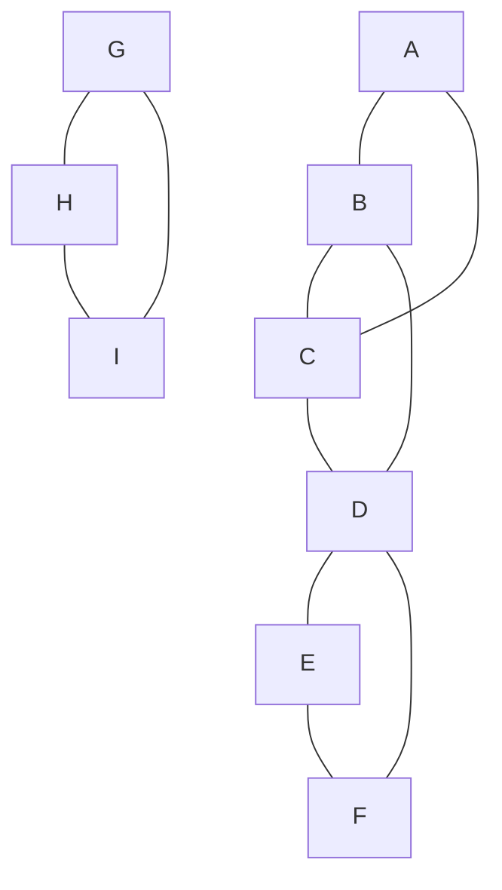
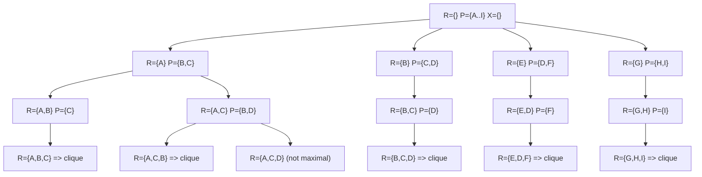

# gograph

## Clique Bron–Kerbosch Algorithm with Pivot + Degeneracy

### What is a Clique?

A clique in a graph is a subset of vertices such that every pair of vertices is connected by an edge.
- A maximal clique is a clique that cannot be extended by adding any other vertex from the graph.
- A maximum clique is the largest clique by size (this is a harder problem).

Example:
- In a triangle graph A—B—C—A, the set {A,B,C} is a maximal clique (and also maximum).
- If you add another vertex D connected only to B and C, then {B,C,D} is another maximal clique.

### Why Are Cliques Useful?

Clique detection has real-world applications in many fields:
- **Social networks:** find groups of people where everyone knows each other.
- **Bioinformatics:** detect protein interaction groups.
- **Recommendation systems:** find strongly related sets of items.
- **Communication networks:** detect communities in graphs.
- **Data mining & clustering:** identify dense subgraphs representing hidden structures.

### Bron–Kerbosch Algorithm with Pivot + Degeneracy
This implementation uses the **Bron–Kerbosch algorithm with pivoting, degeneracy ordering, and bitsets:**
1. **Bron–Kerbosch recursion:** Expands a current partial clique R by exploring candidates P while excluding already processed vertices X.
2. **Pivoting:** Avoids redundant searches by selecting a **pivot vertex** with many neighbors, reducing the branching factor.
3. **Degeneracy ordering:** Orders vertices by minimum degree expansion, ensuring the recursion explores smaller candidate sets first, greatly improving efficiency on sparse graphs.
4. **Bitsets:** Efficiently represent and update sets (P, X, neighbors) using bitwise operations, reducing memory overhead and speeding up intersections.

### Time Complexity
- **Worst-case:** The number of maximal cliques in a graph can be **exponential** in the number of vertices `(O(3^(n/3)))`.
- **Example:** A graph of `n/3` disjoint triangles has `3^(n/3)` maximal cliques.
- **With degeneracy ordering:** Time complexity becomes `O(d * n * 3^(d/3))`, where `d` is the graph degeneracy (small for sparse real-world graphs).
- **Practical performance:** On real-world sparse networks, this approach is highly efficient compared to the naive algorithm.

### Space Complexity
- Bitset representation uses `O(n^2 / 64)` bits in the worst case (adjacency representation).
- Recursion depth is bounded by the size of the largest clique (`≤ n`).
- Overall space: `O(n^2`) for adjacency + `O(n)` recursion stack.

### Example 
The algorithm maintains three sets:
- **R →** the current growing clique
- **P →** possible vertices that can expand `R`
- **X →** vertices already considered (to avoid duplicates)
At each step, we expand `R` with candidates from `P`, update sets, and recurse until `P` is empty. When both `P` and `X` are empty → we found a **maximal clique.**

Vertices: `A, B, C, D, E, F, G, H, I`

#### Stepwise Visual (Table of R, P, X)
| Step | R (Current Clique) | P (Candidates)      | X (Excluded) | Action / Result          |
| ---- | ------------------ | ------------------- | ------------ | ------------------------ |
| 0    | {}                 | {A,B,C,D,E,F,G,H,I} | {}           | Start algorithm          |
| 1    | {A}                | {B,C}               | {}           | Expand with A            |
| 2    | {A,B}              | {C}                 | {}           | Expand with B            |
| 3    | {A,B,C}            | {}                  | {}           | ✅ Maximal clique {A,B,C} |
| 4    | {A,C}              | {B,D}               | {}           | Expand with C            |
| 5    | {A,C,B}            | {}                  | {}           | Duplicate {A,B,C}        |
| 6    | {A,C,D}            | {}                  | {}           | Not maximal              |
| 7    | {B}                | {C,D}               | {A}          | Expand with B            |
| 8    | {B,C}              | {D}                 | {A}          | Expand with C            |
| 9    | {B,C,D}            | {}                  | {A}          | ✅ Maximal clique {B,C,D} |
| 10   | {E}                | {D,F}               | {}           | Expand with E            |
| 11   | {E,D}              | {F}                 | {}           | Expand with D            |
| 12   | {E,D,F}            | {}                  | {}           | ✅ Maximal clique {D,E,F} |
| 13   | {G}                | {H,I}               | {}           | Expand with G            |
| 14   | {G,H}              | {I}                 | {}           | Expand with H            |
| 15   | {G,H,I}            | {}                  | {}           | ✅ Maximal clique {G,H,I} |

**Final Cliques**
- {A, B, C}
- {B, C, D}
- {D, E, F}
- {G, H, I}

#### Recursion Tree

### References
- [Bron–Kerbosch algorithm (Wikipedia)](https://en.wikipedia.org/wiki/Bron%E2%80%93Kerbosch_algorithm)
- Eppstein, David, et al. Listing all maximal cliques in sparse graphs in near-optimal time.
- Applications of clique problems in [network science](https://en.wikipedia.org/wiki/Clique_problem)
