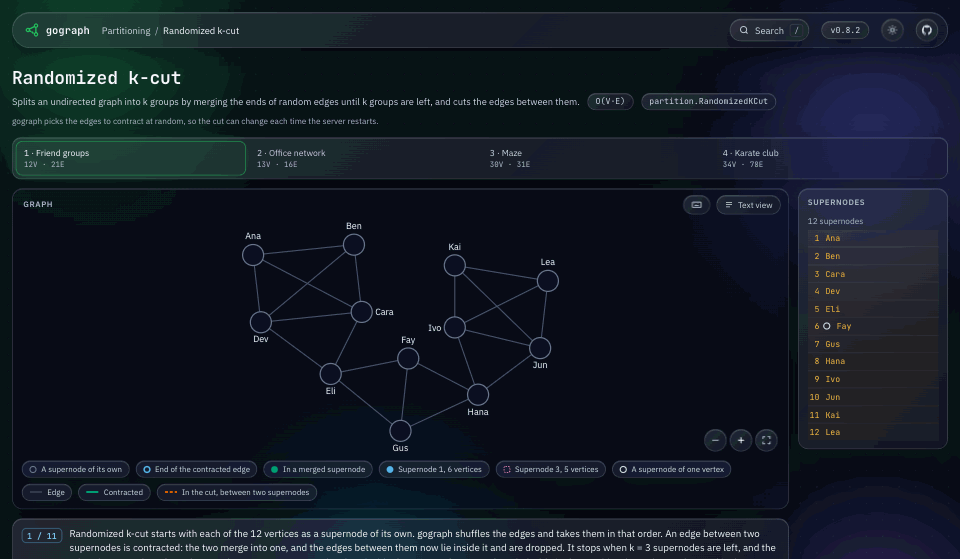
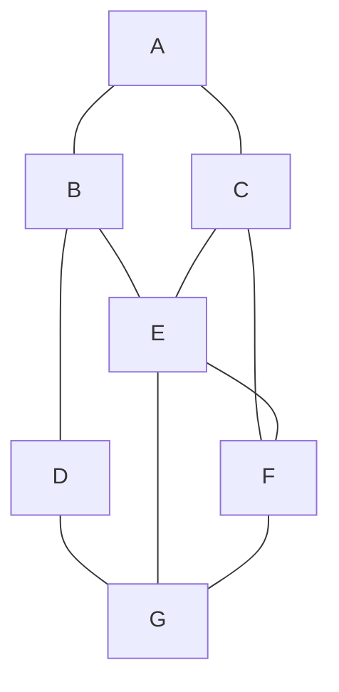
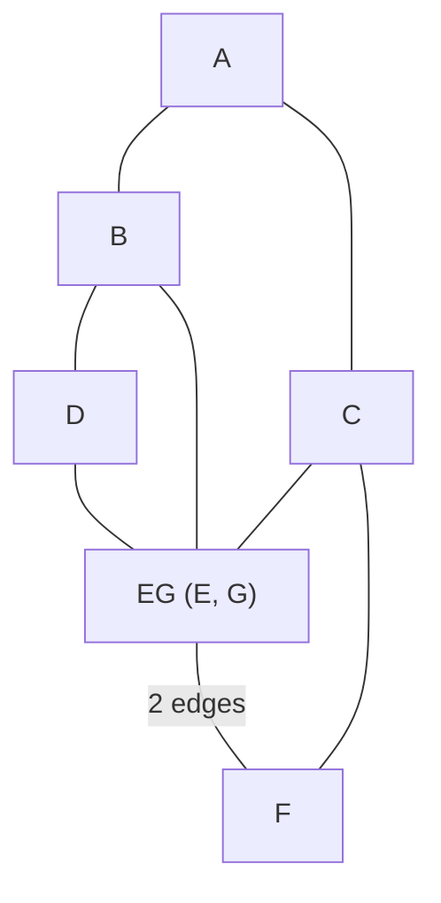
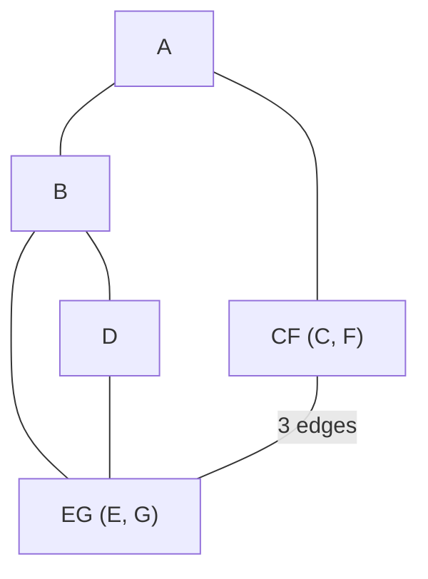
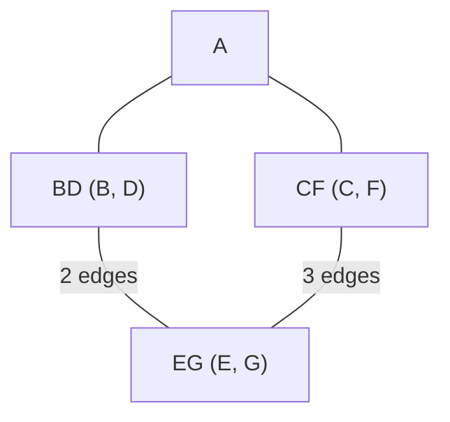
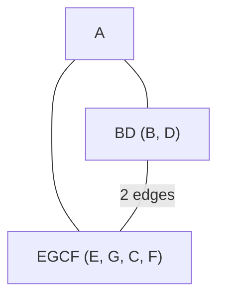

# gograph

## K-Cut

### Randomized Approximate
The Randomized K-Cut algorithm is a probabilistic graph partitioning algorithm. It is a generalization of Karger's famous Min-Cut algorithm. The goal is to find a partition of an undirected graph's vertices into `k` non-empty subsets by removing the fewest number of edges (a minimum k-cut).

The core idea is simple: repeatedly contract randomly chosen edges until exactly k "super-nodes" remain. Each super-node represents a cluster of the original graph's vertices. The set of edges that were not contracted and that connect these final `k` super-nodes is the candidate k-cut.

  
   
  <code>partition.RandomizedKCut</code> splitting a small social graph into three groups. <a href="https://gograph.dev/algorithms/randomized-k-cut/friend-groups">Run it step by step on gograph.dev</a>.

**Time Complexity:** O(n * m) per run, where n is the number of vertices and m is the number of edges in the graph.
**Space Complexity:** O(n + m) for storing vertex sets and edge lists.

#### How does it work?
##### Initial Graph (Step 0)

We begin with the original graph of 7 nodes (A, B, C, D, E, F, G). The true minimum 3-cut for this graph is 4 edges.

**Step 1: Contracting Edge (E, G) into node EG**
**Correction:** The edge between F and G becomes an edge between F and EG.

**Nodes:** A, B, C, D, F, EG
**Edges:** A-B, A-C, B-D, B-EG, C-EG, C-F, D-EG, EG-F (2 edges: E-F and F-G)

##### Step 2: Contracting Edge (C, F) into node CF

**Critical Correction:** Let's list all edges connected to C and F before contraction:

    C is connected to: A, EG, F

    F is connected to: C, EG, G (but G is now part of EG, so this is just EG)

**After contracting C and F into CF:**

    Edges from C: A-EG, C-F (self-loop, removed)

    Edges from F: EG (already exists), C-F (self-loop, removed)

    The edge **C-F is removed** as a self-loop.

    The new edges are: **A-CF**, **CF-EG**. CF and EG are joined by 3 edges: C-E, E-F and F-G.

**There is no original edge that would create a connection from B or D to CF.**

**Nodes:** A, B, D, EG, CF
**Edges:** A-B, A-CF, B-D, B-EG, D-EG, CF-EG (3 edges)

##### Step 3: Contracting Edge (B, D) into node BD

**Correction:** Let's list all edges connected to B and D before contraction:

    B is connected to: A, D, EG

    D is connected to: B, EG

**After contracting B and D into BD:**

    Edges from B: A, D (self-loop, removed), EG

    Edges from D: B (self-loop, removed), EG

    The edges **B-D and D-B are removed** as self-loops.

    The new edges are: **A-BD, BD-EG**. BD and EG are joined by 2 edges: B-E and D-G.

    **There is still no edge between BD and CF.**

**Nodes:** A, BD, EG, CF
**Edges:** A-BD, A-CF, BD-EG (2 edges), CF-EG (3 edges)

##### Step 4: Final Contraction to reach k=3

We need to get from 4 nodes down to 3. We must contract one more edge. Our choices are:

    Contract (A, BD)

    Contract (A, CF)

    Contract (BD, EG)

    Contract (CF, EG)

Let's choose to contract **(CF, EG)** into a new super-node **EGCF**.

**After contracting CF and EG into EGCF:**

    Edges from CF: A, EG (self-loop, removed)

    Edges from EG: BD, CF (self-loop, removed)

    The new edges are: **A-EGCF, BD-EGCF**.

**Final Clusters (The 3-Cut):**

    Cluster A: {A}

    Cluster BD: {B, D}

    Cluster EGCF: {E, G, C, F}

**Edges in the Cut (between clusters):**

    Between **A** and **BD**: Edge A-B

    Between **A** and **EGCF**: Edge A-C

    Between **BD** and **EGCF**: Edges B-E and D-G

**Cut Size:** 4 edges (A-B, A-C, B-E, D-G).