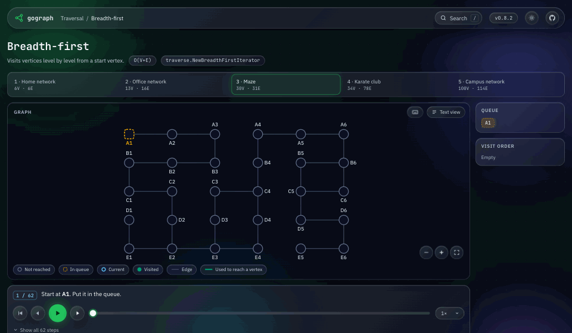
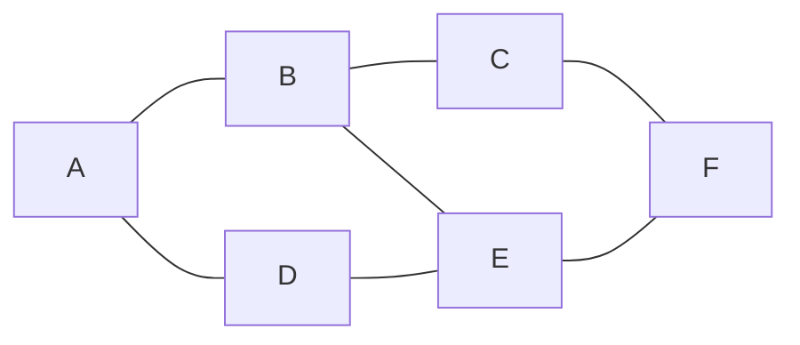
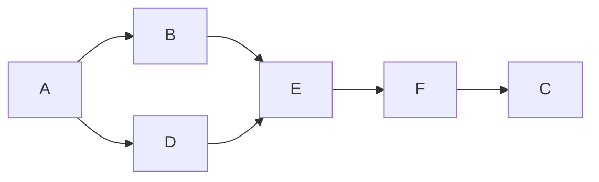
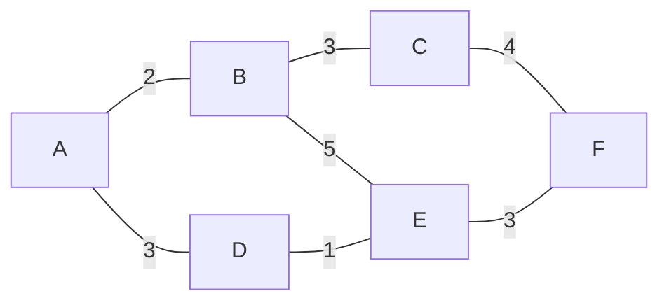

# gograph - Traverse

Graph traversal is an important operation in computer science that involves
visiting each node in a graph at least once. There are several graph traversal
algorithms that are commonly used to explore graphs in different ways.
The `gograph/traverse` package is a Go library that provides efficient implementation
of five of these algorithms:

* [BFS](#BFS)
* [DFS](#DFS)
* [Topological Sort](#Topological-Sort)
* [Closest First](#Closest-First)
* [Random Walk](#Random-Walk)

<p align="center">
  <a href="https://gograph.dev/algorithms/bfs/maze"></a>
  <br>
  <sub><code>traverse.NewBreadthFirstIterator</code> exploring a maze level by level. <a href="https://gograph.dev/algorithms/bfs/maze">Run it step by step on gograph.dev</a>.</sub>
</p>

All the traversal algorithms in the 'traverse' package are implemented the following
iterator interface:

```go
// Iterator represents a general purpose iterator for iterating over
// a sequence of graph's vertices. It provides methods for checking if
// there are more elements to be iterated over, getting the next element,
// iterating over all elements using a callback function, and resetting
// the iterator to its initial state.
type Iterator[T comparable] interface {
	// HasNext returns a boolean value indicating whether there are more
	// elements to be iterated over. It returns true if there are more
	// elements. Otherwise, returns false.
	HasNext() bool

	// Next returns the next element in the sequence being iterated over.
	// If there are no more elements, it returns nil. It also advances
	// the iterator to the next element.
	Next() *gograph.Vertex[T]

	// Iterate iterates over all elements in the sequence and calls the
	// provided callback function on each element. The callback function
	// takes a single argument of type *Vertex, representing the current
	// element being iterated over. It returns an error value, which is
	// returned by the Iterate method. If the callback function returns
	// an error, iteration is stopped and the error is returned.
	Iterate(func(v *gograph.Vertex[T]) error) error

	// Reset  resets the iterator to its initial state, allowing the
	// sequence to be iterated over again from the beginning.
	Reset()
}
```

## BFS

BFS iterator is a technique used to implement the Breadth-First Search (BFS)
algorithm for traversing a graph or tree in a systematic way. The BFS iterator
iteratively visits all the vertices of the graph, starting from a given source
vertex and moving outwards in levels. The iterator maintains a queue of vertices
to be visited, and it visits each vertex only once.

One of the most common usages of BFS iterator is to find the shortest path between
two vertices in an unweighted graph. It can also be used to perform level-order
traversal of a binary tree or to find all the vertices at a given distance from a
starting vertex. BFS iterator is also commonly used in graph algorithms, such as
finding connected components, bipartite graphs, and cycle detection.

The time complexity of the BFS iterator algorithm is O(V + E), where V is the
number of vertices and E is the number of edges in the graph. This is because
the algorithm visits each vertex and edge exactly once. The space complexity of
BFS iterator is O(V), where V is the number of vertices in the graph. This is
because the algorithm uses a queue to store the vertices to be visited. The
maximum size of the queue is equal to the number of vertices at the maximum
depth of the BFS traversal.

For example, on this undirected graph:



the BFS iterator that starts from A returns A, B, D, C, E, F.
[Run BFS step by step on gograph.dev](https://gograph.dev/algorithms/bfs/home-network), with the queue
and the visited vertices at each step.

## DFS

DFS iterator is a technique used to implement the Depth-First Search (DFS)
algorithm for traversing a graph or tree in a systematic way. The DFS iterator
recursively visits all the vertices of the graph, starting from a given
source vertex and exploring as far as possible along each branch before
backtracking. The iterator maintains a stack of vertices to be visited,
and it visits each vertex only once.

One of the most common usages of DFS iterator is to find connected components
in a graph. It can also be used to detect cycles in a graph, find strongly
connected components in a directed graph, and perform topological sorting.
In addition, DFS iterator can be used to find all paths between two vertices
in a graph and to solve puzzles such as the n-queens problem.

The time complexity of the DFS iterator algorithm is O(V + E), where V is
the number of vertices and E is the number of edges in the graph. This is
because the algorithm visits each vertex and edge exactly once. The space
complexity of DFS iterator is O(V), where V is the number of vertices in
the graph. This is because the algorithm uses a stack to store the vertices
to be visited, and the maximum size of the stack is equal to the maximum
depth of the DFS traversal.

On the same graph as the BFS example, the DFS iterator that starts from A returns
A, D, E, F, C, B.
[Run DFS step by step on gograph.dev](https://gograph.dev/algorithms/dfs/home-network), with the stack
and the visited vertices at each step.

## Topological Sort

Topological iterator is a technique used to implement the Topological Sort
algorithm for sorting the vertices of a directed acyclic graph (DAG) in a
linear ordering. The topological sort orders the vertices such that for every
directed edge (u, v), vertex u comes before vertex v in the ordering.
Topological iterator iteratively removes the vertices with no incoming
edges and adds them to the sorted list. It then removes the outgoing edges
of the removed vertex and repeats the process.

One of the most common usages of topological iterator is to schedule tasks
or dependencies in a project based on their dependencies. It can also be
used to detect cycles in a DAG, which indicates a circular dependency that
makes it impossible to find a topological ordering. In addition, topological
iterator can be used to generate a linear ordering of events in a causal
relationship, such as in a concurrent system or a timeline of events.

The time complexity of topological iterator algorithm is O(V + E), where V
is the number of vertices and E is the number of edges in the graph.
This is because the algorithm visits each vertex and edge exactly once.
The space complexity of topological iterator is O(V), where V is the number
of vertices in the graph. This is because the algorithm uses a queue to store
the vertices to be visited, and the maximum size of the queue is equal to
the number of vertices in the graph.

For example, on this directed acyclic graph:



the topological iterator returns A, B, D, E, F, C.
[Run the topological sort step by step on gograph.dev](https://gograph.dev/algorithms/topological-sort/build-pipeline),
with the queue and the in-degree of each vertex at each step.

## Closest First

Closest-first traversal, also known as the Best-First search or Greedy Best-First
search, is a technique used to traverse a graph or a tree based on the distance
between vertices and a given source vertex. The algorithm iteratively visits the
vertex closest to the source vertex first and then expands its neighbors, repeating
this process until all vertices have been visited. The distance can be defined in
various ways, such as the number of edges, the weight of the edges, or any other
distance metric.

One of the most common usages of closest-first iterator is to find the shortest path
between two vertices in a graph or to perform nearest-neighbor searches in machine
learning or recommendation systems. It can also be used for clustering, community
detection, and network analysis.

The time and space complexity of closest-first iterator depend on the implementation
of the distance metric and the data structure used for storing the vertices and their
distances. If the distance metric is constant and the graph is represented as an
adjacency matrix, the time complexity of closest-first iterator is O(V^2), where V is
the number of vertices in the graph. If the distance metric is variable and the graph
is represented as an adjacency list, the time complexity of closest-first iterator is
O(E log V), where E is the number of edges in the graph. The space complexity of
closest-first iterator is also O(V) for storing the distances and the visited vertices.

For example, on this weighted graph:



the closest-first iterator that starts from A returns A, B, D, E, C, F.
[Run closest-first step by step on gograph.dev](https://gograph.dev/algorithms/closest-first/school-run),
with the priority queue at each step.

## Random Walk

Random walk iterator is a technique used to traverse a graph in a stochastic manner by
randomly selecting the next vertex to visit based on a probability distribution. In the
context of graph traversal, random walk iterator can be categorized into two types:
weighted and unweighted.

In the weighted random walk iterator, the probability distribution for selecting the next
vertex to visit is proportional to the weights of the edges connecting the current vertex
to its neighbors. This means that edges with higher weights have a higher probability of
being selected in the random walk. Weighted random walk iterator is commonly used in
applications such as recommendation systems, where we want to find similar items or users based on their interactions in
a network. Edges with a weight of zero or less are never selected, unless none of the
edges of the current vertex has a positive weight. Then each of them has an equal
probability.

In the unweighted random walk iterator, the probability distribution for selecting the
next vertex to visit is uniform and does not depend on the weights of the edges. This
means that all neighbors of the current vertex have an equal probability of being selected
in the random walk. Unweighted random walk iterator is commonly used in applications such
as web crawling, where we want to explore the web in a random and unbiased manner.

The time and space complexity of random walk iterator depend on the size and structure
of the graph, the number of vertices visited, and the type of random walk iterator used.
In general, the time complexity of random walk iterator is proportional to the number
of edges in the graph, while the space complexity is proportional to the number of visited
vertices.

[Run a random walk step by step on gograph.dev](https://gograph.dev/algorithms/random-walk/service-calls).